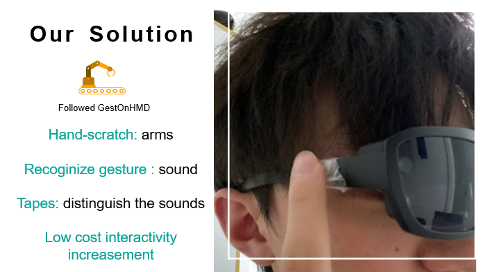
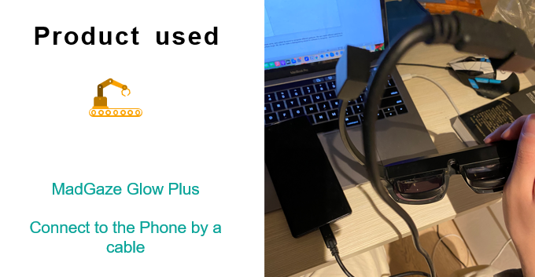
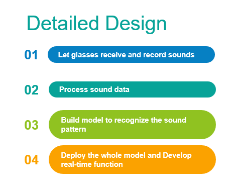

# GestOnAR: Hand-scratching Gesture Recognition on AR Glasses
This project is my final year project in my bachelor degree under supervison of Dr Kening Zhu in City University of Hong Kong. Code details are hidden because of the AR Glasses company principle. The deliverable is an Android application which use CNN to identity sound patterns of gestures.

